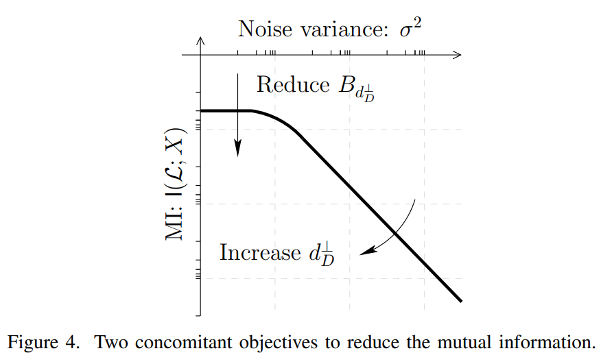
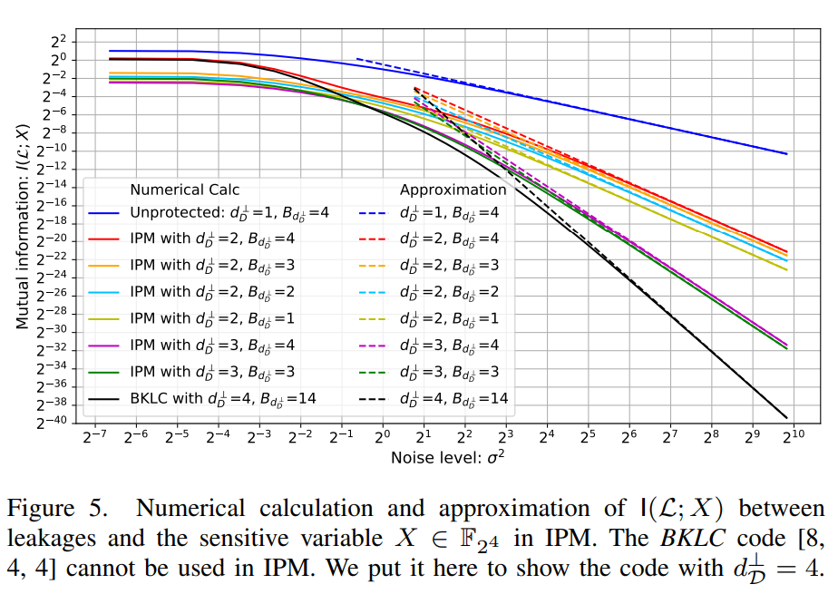

# About

## Optimal Codes for Inner Product Masking[[1,2]](#references)

We present here the exhaustive study of all linear codes for Inner Product Masking (IPM) and show how to choose optimal linear codes for IPM. 

Particularly, we give the optimal instances with *n*=2, 3 shares and *l*=4, 8 bits. All linear codes presented here are checked formally by Magma Computational Algebra System [[3]](#references).

## 1 Basics

### 1.1 Weight enumerator of a linear code

The weight enumerator [[4]](#references) specifies the number of codewords of the same Hamming weights in a linear code $\mathcal{C}$. It is defined as:

It can also be denoted as: $[ (i, B_i), ~s.t. ~B_i\neq 0]$. We use the one further compact in this repository to save spaces. For instance, the weight enumerator of the code [8, 4, 4] is $[(0, 1), (4, 14), (8, 1)]$, then we write as $[0,1, 4, 14, 8, 1]$.

### 1.2 Equivalent codes

Two linear codes are said to be equivalent if one can be obtained from the other by a series of operations of the following two types:

1) an arbitrary permutation of the coordinate positions, and
2) in any coordinate position, multiplication by any nonzero scalar.

It is interesting to notice that equivalent linear codes have the same weight distribution.

## 2 Optimal codes for IPM

We present hereafter an exhaustive study of the linear codes for IPM, and show the optimal codes that can be a takeaway conclusion.

### 2.1 IPM with $n$=2 shares and $l$=4 bits

See here: [Optimal codes IPM (**n=2 & $l$=4**).](https://nbviewer.jupyter.org/github/Qomo-CHENG/OC-IPM/blob/master/optimal_codes/ipm_codes_n2k4.ipynb)

The optimal codes are given in **[Tab. II](https://nbviewer.jupyter.org/github/Qomo-CHENG/OC-IPM/blob/master/optimal_codes/ipm_codes_n2k4.ipynb)** in Section 2. We also present one example of [*BKLC*](http://magma.maths.usyd.edu.au/magma/handbook/text/1881#21217) code with parameter [8, 4, 4] which is better than all codes used in IPM. This *BKLC* code has been used in **RSM** (Rotating Sbox Masking) scheme during [DPA Contest V4.1&4.2](http://www.dpacontest.org/v4/index.php).

### 2.2 IPM with $n$=2 shares and $l$=8 bits

See here: [Optimal codes IPM (**n=2 & $l$=8**).](https://nbviewer.jupyter.org/github/Qomo-CHENG/OC-IPM/blob/master/optimal_codes/ipm_codes_n2k8.ipynb)

The optimal codes are given in **[Tab. II](https://nbviewer.jupyter.org/github/Qomo-CHENG/OC-IPM/blob/master/optimal_codes/ipm_codes_n2k8.ipynb)** in Section 2. We also present one example of [*BKLC*](http://magma.maths.usyd.edu.au/magma/handbook/text/1881#21217) code with parameter [16, 8, 5] which is better than all codes used in IPM.

### 2.3 IPM with $n$=3 shares and $l$=4 bits

See here: [Optimal codes IPM (**n=3 & $l$=4**).](https://nbviewer.jupyter.org/github/Qomo-CHENG/OC-IPM/blob/master/optimal_codes/ipm_codes_n3k4.ipynb)

The optimal codes are given in **[Tab. II](https://nbviewer.jupyter.org/github/Qomo-CHENG/OC-IPM/blob/master/optimal_codes/ipm_codes_n3k4.ipynb)** in Section 2. We also present one example of [*BKLC*](http://magma.maths.usyd.edu.au/magma/handbook/text/1881#21217) code with parameter [12, 4, 6], which is equivalent the best codes used in IPM.

### 2.4 IPM with $n$=3 shares and $l$=8 bits

See here: [Optimal codes IPM (**n=3 & $l$=8**).](https://nbviewer.jupyter.org/github/Qomo-CHENG/OC-IPM/blob/master/optimal_codes/ipm_codes_n3k8.ipynb)

We present the weight enumerators of all 255*255=65025 linear codes for IPM. We omit the detaild tables for the sake of brevity, but only present all codes with maximized dual distance $d_{\mathcal{D}}^\perp$.

<!-- Full logs with different combinations of *$L_2$* and *$L_3$*, and also properties of the generated codes (*code parameters*, *generator matrices*, *weight enumerators*, *weight distributions*) are presented here: [Full logs for IPM with *$n=3$* shares and *$l=8$* bits](https://github.com/Qomo-CHENG/OC-IPM/blob/master/weight_enumerators/weight_code_n3k8_full.log). -->

The optimal codes are given in **[Tab. II](https://nbviewer.jupyter.org/github/Qomo-CHENG/OC-IPM/blob/master/optimal_codes/ipm_codes_n3k8.ipynb)** in Section 2. We also present one example of [*BKLC*](http://magma.maths.usyd.edu.au/magma/handbook/text/1881#21217) code with parameter [24, 8, 8], which is not as good as the best codes in IPM.

### 2.5 Information-theoretic evaluation [[4]](#references)

We propose to use two parameters, the dual distance $d_{D}^\perp$ and the coefficient $B_{d_{D}^\perp}$, to characterize the side-channel resistance of IPM. The impact of two parameters on mutual informaiont are depicted as follows [[4, Fig. 4]](#references).

With $n$=2 shares and $l$=4 bits, all sixes classes of IPM codes and also one *BKLC* code are evaulated by using mutual information shown as follows [[4, Fig. 5]](#references). 

## 3 Magma scripts

We share the Magma scripts to easily check the validity of our results. See here: [Magma scripts](https://github.com/Qomo-CHENG/OC-IPM/blob/master/magma_scripts/magma_weight_code_n2k4.m). The corresponding logs are also provided here: [Magma logs](https://github.com/Qomo-CHENG/OC-IPM/blob/master/magma_scripts/magma_weight_code_n2k4.log).

## Copyright and License

This repository is placed into the public domain. Anyone can redistribute it and/or modify it under the terms of the GNU General Public License version 3.0.

Copyright (C) 2020, Télécom Paris - All Rights Reserved to Authors.

## Authors
- Wei CHENG (wei.cheng@telecom-paris.fr)
- Sylvain GUILLEY (sylvain.guilley@secure-ic.com)
- Jean-Luc DANGER (jean-luc.danger@telecom-paris.fr)
- Claude CARLET (claude.carlet@gmail.com)
- Sihem MESNAGER (smesnager@univ-paris8.fr)

## References

[[1]](#references) Josep Balasch, Sebastian Faust, Benedikt Gierlichs, Clara Paglialonga, François-Xavier Standaert.
Consolidating Inner Product Masking. ASIACRYPT (1) 2017: 724-754.

[[2]](#references) Josep Balasch, Sebastian Faust, Benedikt Gierlichs.
Inner Product Masking Revisited. EUROCRYPT (1) 2015: 486-510.

[[3]](#references) Wieb Bosma, John Cannon, and Catherine Playoust, The Magma algebra system. I. The user language, J. Symbolic Comput., 24 (1997), 235–265. Accessed Jan 20, 2019.

[[4]](#references) Wei Cheng, Sylvain Guilley, Claude Carlet, Sihem Mesnager and Jean-Luc Danger, Optimizing Inner Product Masking Scheme by A Coding Theory Approach. The IEEE Transactions on Information Forensics and Security, [doi: 10.1109/TIFS.2020.3009609](https://ieeexplore.ieee.org/document/9141357).

[[5]](#references) Wei Cheng, Claude Carlet, Kouassi Goli, Jean-Luc Danger and Sylvain Guilley. Detecting Faults in Inner Product Masking Scheme - IPM-FD: IPM with Fault Detection. PROOFS 2019: 17-32, 2019.